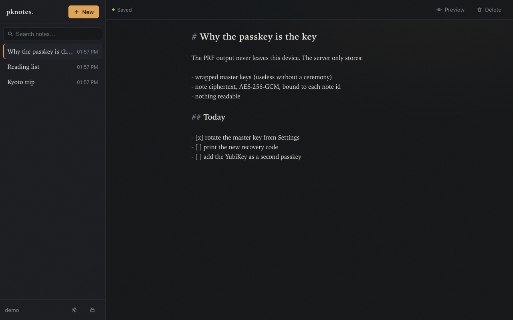

# pknotes

pknotes ("passkey notes") is end-to-end encrypted markdown notes on Cloudflare Workers. The encryption key comes from your passkey, so there is no master password and nothing the server could ever read.

[](https://deploy.workers.cloudflare.com/?url=https://github.com/ddyy/pknotes)



**Try it:** [pknotes-demo.dydev.workers.dev](https://pknotes-demo.dydev.workers.dev) — a
public demo instance. Create a throwaway account with any passkey; demo data
may be wiped at any time.

> **Status**: working and self-hostable. It has not had an independent security audit. Treat it as a personal deployment, not a public service. Per-IP rate limits guard the auth endpoints, and registration can be closed once you've made your account (see below).

## How the encryption works

```
Passkey (iCloud Keychain / Google Password Manager / security key)
   │  WebAuthn PRF extension → 32 deterministic, credential-bound bytes
   ▼
HKDF-SHA256 → KEK (key-encryption key, never leaves the browser)
   │  unwraps
   ▼
Master key (random AES-256, generated once at signup)
   │  encrypts (AES-256-GCM, fresh IV per save)
   ▼
Notes (markdown)
```

- One WebAuthn ceremony does double duty: the server verifies the assertion (login), the client reads the PRF output (decryption). The PRF bytes never leave the browser.
- The server (Workers + D1) stores WebAuthn public keys, wrapped copies of the master key, and note ciphertext. A full database dump yields nothing readable.
- Each passkey wraps the same master key, so adding a device is a single wrap with no re-encryption. Passkeys sync through their platform (iCloud Keychain etc.), which gives you multi-device access for free.
- A one-time recovery code (160-bit, shown once at signup) also wraps the master key. The server stores a hash of a *verifier* derived from the code; the KEK derived from it stays client-side.

## Threat model

Being explicit about what this design does and does not defend against:

**The server never holds anything readable.** It stores WebAuthn public keys,
wrapped (encrypted) master keys, note ciphertext, and a hash of the recovery
verifier. A full database dump, a subpoena, or a malicious database admin
yields nothing decryptable. Each note's ciphertext is also bound to its note
id (AES-GCM additional data), so the server can't swap ciphertexts between
notes undetected.

**What the server does see:** metadata — how many notes you have, when they
change, their approximate sizes, and your IP. It can also withhold data or
serve a *stale* version of a note (it can't forge or swap one). If your
threat model includes traffic analysis of a notes app, this isn't the tool.

**The trust floor every web E2EE app shares:** whoever serves the JavaScript
could ship a malicious client that exfiltrates keys. That's true of this app
exactly as it is of Proton, Bitwarden's web vault, and every other browser
E2EE product. pknotes' mitigations are structural: the client is small enough
to audit (~1,500 lines, one crypto dependency, no third-party scripts or
CDNs), and self-hosting makes *you* the party serving the code. If you need
stronger guarantees than that, you need a pinned native client — which the
web cannot provide.

**Revocation is rotation.** Removing a passkey blocks future logins, but a
compromised device may already hold the master key. "Rotate master key" in
Settings is the real revocation: fresh key, every note re-encrypted, all
other passkeys cut off, new recovery code. Recovery codes are single-use —
redeeming one invalidates it (after a short retry grace) and issues a
replacement.

**Abuse limits:** per-IP rate limits guard registration, login, and recovery;
personal instances should close registration entirely (see Deploy).

**No independent audit has been performed.** Read the code — it's short on
purpose.

## Roadmap

- **Offline (PWA)** — the architecture already supports offline *unlock*:
  decryption never depended on the server, so a cached ciphertext mirror +
  a local WebAuthn ceremony can open your notes on a plane. Service worker
  and offline write queue to come.
- **Encrypted note sharing** — per-note keys sealed to another user's
  passkey-wrapped public key. Design notes exist; ships after the
  verification story ("is this really Alice?") is settled.
- **Import** — export exists (Settings → zip of markdown); import is the
  missing half.

## Stack

- **Worker**: [Hono](https://hono.dev) + `@simplewebauthn/server`, sessions via HMAC-signed HttpOnly cookies
- **Storage**: D1 (`migrations/`)
- **Client**: React + Vite (`@cloudflare/vite-plugin`), CodeMirror 6 markdown editor, `markdown-it` + DOMPurify preview
- **Crypto**: WebCrypto only. AES-256-GCM, HKDF-SHA256, WebAuthn PRF.

## Develop

```sh
npm install
npm run dev   # applies local D1 migrations automatically, then starts vite + workerd on localhost:5173
```

Passkeys work on `localhost` without HTTPS. `.dev.vars` holds the dev `SESSION_SECRET` (created automatically on first run).

```sh
npm test   # crypto/format unit tests (node:test) + Worker/D1 integration
           # tests for auth, note CRUD, and rotation concurrency (vitest-pool-workers)
```

## Deploy

**One click**: use the button at the top. Cloudflare clones the repo into your account, provisions the D1 database (the placeholder `database_id` in `wrangler.jsonc` is replaced for you), and asks for `SESSION_SECRET` during setup. Use a long random string, e.g. `openssl rand -base64 32`. Migrations run as part of the deploy script.

**Manual**:

```sh
npx wrangler d1 create pknotes            # once; put the id in wrangler.jsonc
npx wrangler secret put SESSION_SECRET    # long random string
npm run deploy                            # build + migrate + deploy
```

Once your account (and any family/friends' accounts) exist, close signup — new
registrations get a 403 while everything else keeps working:

```sh
npx wrangler secret put ALLOW_REGISTRATION   # enter: false
```

For shared or demo instances that stay open, an optional per-account note cap
bounds what any one account can accumulate (unset = unlimited):

```sh
npx wrangler secret put MAX_NOTES_PER_USER   # e.g. 100
```

To keep working from a clone of this repo without committing your `database_id`
(e.g. it came from the deploy button), put it in a gitignored `.deploy.local.json`
instead and use `npm run deploy:local`:

```json
{ "database_id": "xxxxxxxx-xxxx-xxxx-xxxx-xxxxxxxxxxxx" }
```

## Requirements & caveats

- Browsers need the WebAuthn **PRF extension**: Chrome/Edge, Safari 18+ (iOS/iPadOS 18.4+), recent Firefox.
- The **passkey provider** must support PRF too. Google Password Manager, iCloud Keychain, 1Password, and FIDO2 hardware keys with `hmac-secret` all do. The **Bitwarden extension does not** ([bitwarden#13838](https://github.com/orgs/bitwarden/discussions/13838)); dismiss its prompt to fall back to your browser's built-in passkeys. pknotes detects the gap at signup and fails with a clear message before creating an account.
- The master key lives in memory only while unlocked; a page reload locks the vault.
- Losing every passkey **and** the recovery code means the notes are gone for good. That is the point of zero-knowledge: nobody can reset what the server cannot read.
- When the same note is saved from two devices, both versions are kept (one becomes a "conflict copy" note). Nothing is merged.
